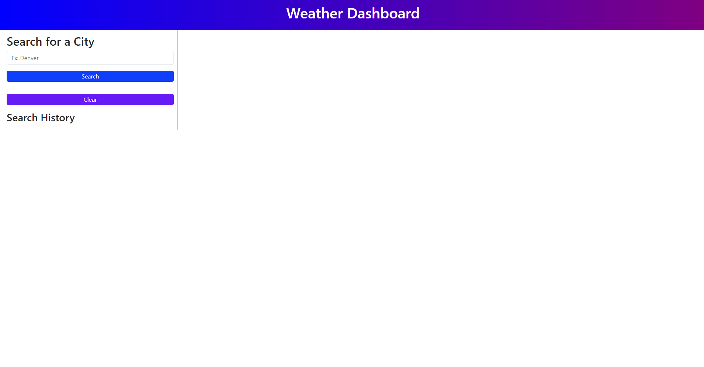
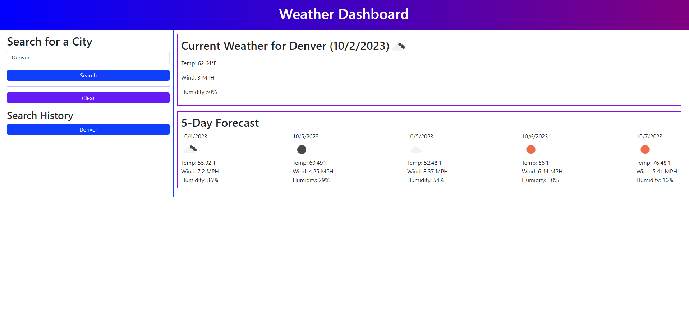
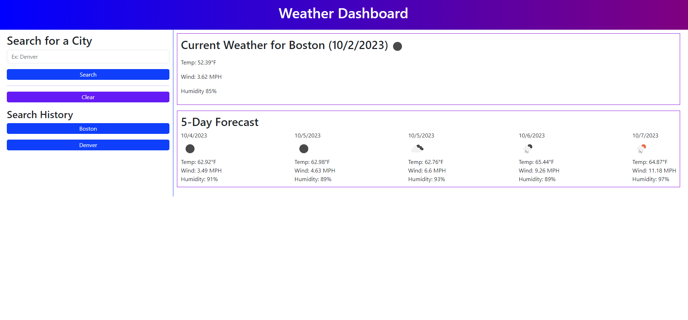
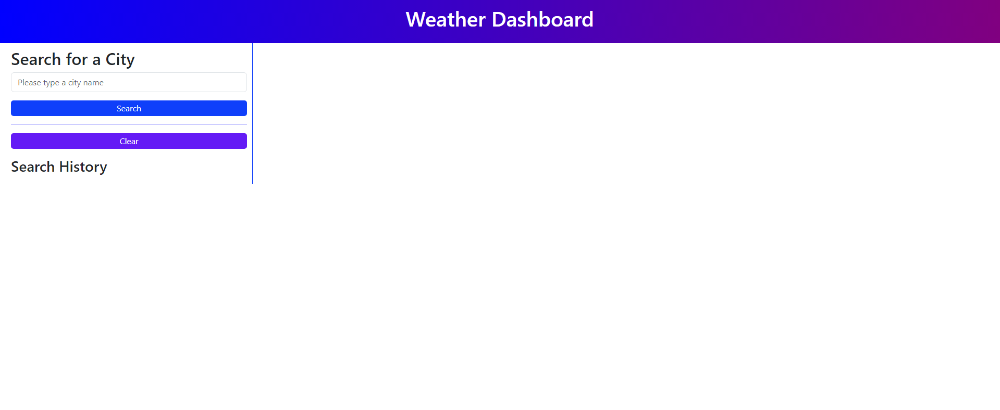

# Brandon Weather Dashboard Challenge 6

[Live deploy link](https://bwing2.github.io/brandon-weather-dashboard-challenge-6/)

## Description

As a developer, it is important to be able to use API's to call and recieve information in the form on requests and responses. This project challenged me to fully understanding a third party API, and be able to display important information that was relevant to the task. I tried to manipulate the DOM as much as I could in JavaScript, and to not use jQuery as an extra challenge for myself.The hardest part was figuring out how to use local storage so that the buttons in my search history linked back to the previous cities. I learned a lot about the importance of reading documentation for third party API's, and have gotten more comfortable with local storage and DOM manipulation.

## Installation

1. Go to repository main page.
2. Click the green `<> Code` button.
3. Click the SSH button under the Clone heading, and copy the link.
4. Open the terminal.
5. `cd` into the location you want the file to be stored.
6. type `git clone`, and then paste the URL that was copied.
7. Press enter, and you should see a message containing "Cloning into 'directory name'...",meaning you are successful.
8. Open VS Code using `code .` and the copied repository should be there.

## Usage

### Weather Dashboard Home Page

### Searching a City

### Using Search History

### No City Selected

## License

MIT License

Copyright (c) 2023 Brandon Wing

Permission is hereby granted, free of charge, to any person obtaining a copy of this software and associated documentation files (the "Software"), to deal in the Software without restriction, including without limitation the rights to use, copy, modify, merge, publish, distribute, sublicense, and/or sell copies of the Software, and to permit persons to whom the Software is furnished to do so, subject to the following conditions:

The above copyright notice and this permission notice shall be included in all copies or substantial portions of the Software.

THE SOFTWARE IS PROVIDED "AS IS", WITHOUT WARRANTY OF ANY KIND, EXPRESS OR IMPLIED, INCLUDING BUT NOT LIMITED TO THE WARRANTIES OF MERCHANTABILITY, FITNESS FOR A PARTICULAR PURPOSE AND NONINFRINGEMENT. IN NO EVENT SHALL THE AUTHORS OR COPYRIGHT HOLDERS BE LIABLE FOR ANY CLAIM, DAMAGES OR OTHER LIABILITY, WHETHER IN AN ACTION OF CONTRACT, TORT OR OTHERWISE, ARISING FROM, OUT OF OR IN CONNECTION WITH THE SOFTWARE OR THE USE OR OTHER DEALINGS IN THE SOFTWARE.
